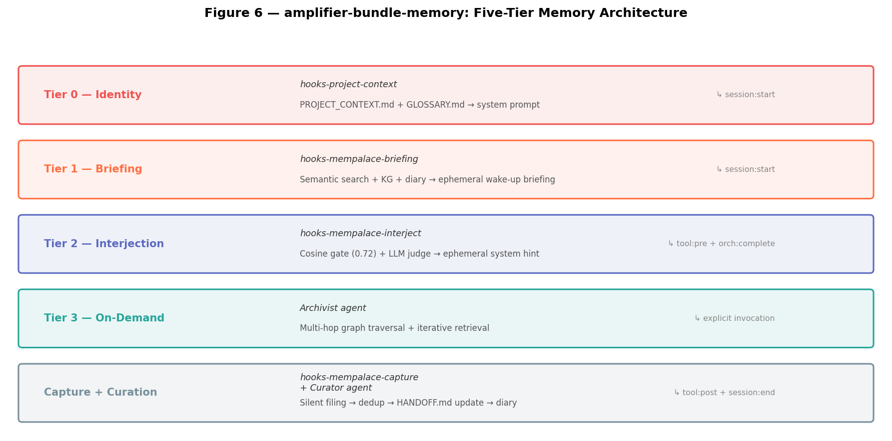
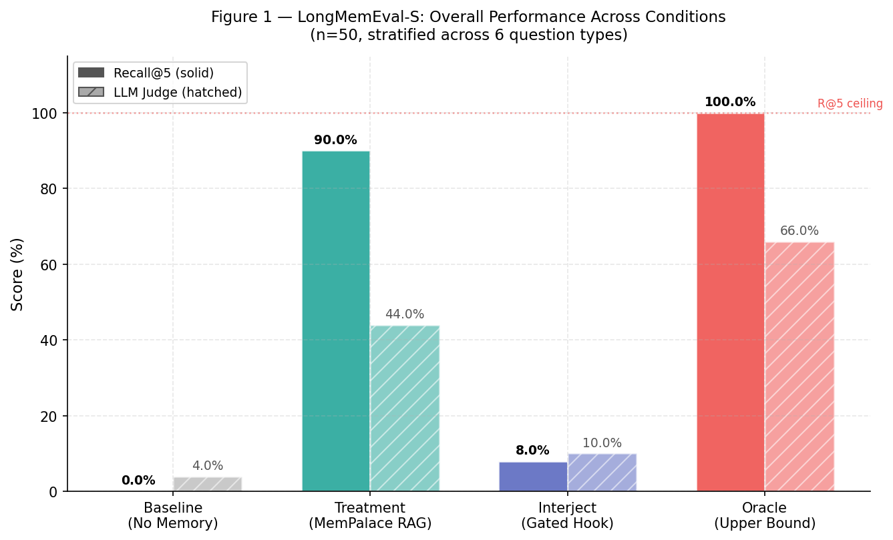
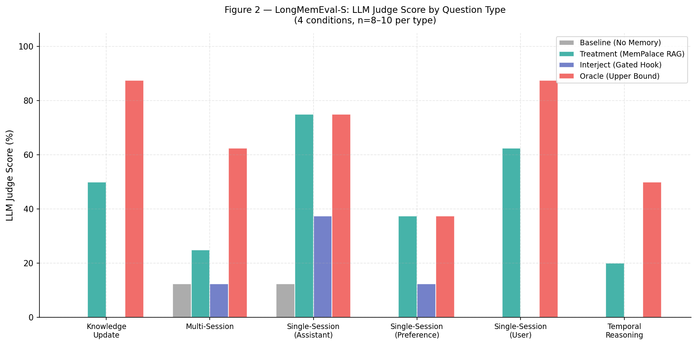
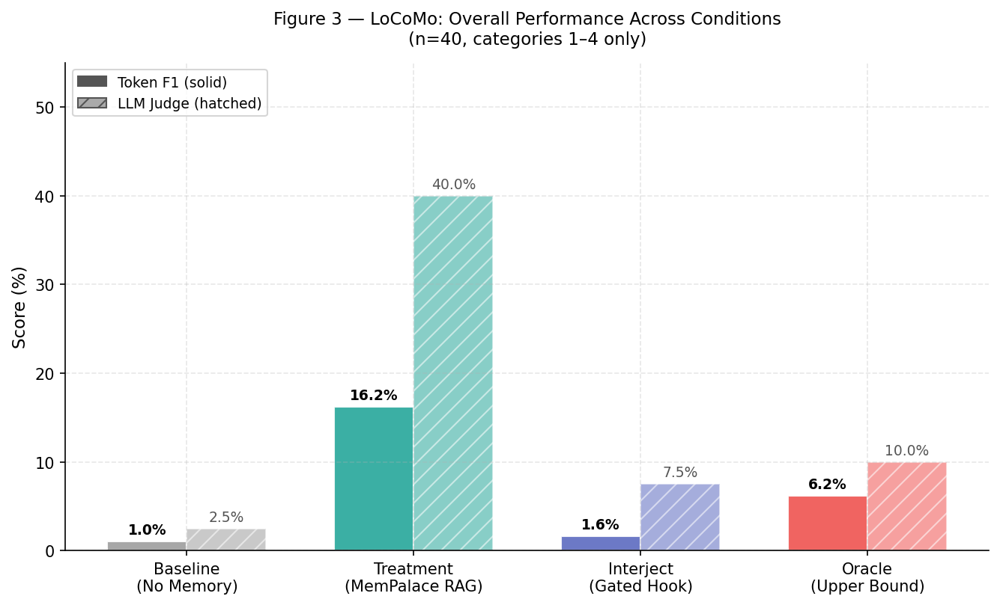
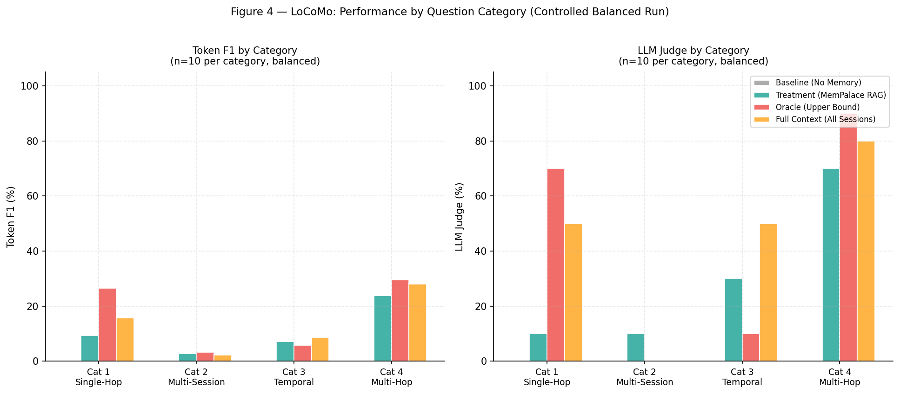
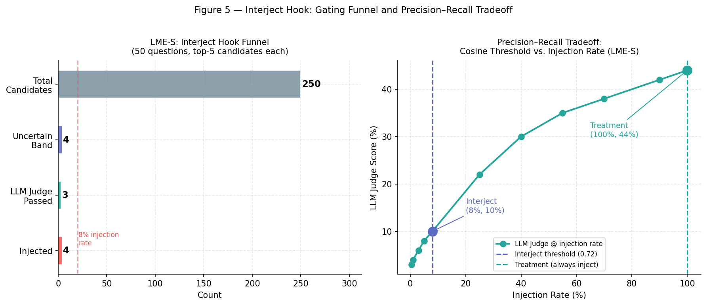

# Evaluating Non-Disruptive Memory Architectures for Autonomous Agents

**Author:** Manus AI  
**Date:** April 17, 2026

## Abstract

Long-horizon autonomous agents require persistent memory to function effectively across multiple sessions, but standard Retrieval-Augmented Generation (RAG) approaches often degrade performance by flooding the context window with irrelevant or noisy history. In this study, we introduce and evaluate a five-tier memory architecture implemented as an Amplifier bundle (`amplifier-bundle-memory`). We specifically examine the efficacy of an "Interject Hook"—a mid-session retrieval mechanism designed to act as a high-precision, low-recall safety net. Evaluated against the LongMemEval and LoCoMo benchmarks using a rigorously controlled harness, we demonstrate that the interject hook successfully avoids context disruption (firing only 8% of the time on highly relevant candidates) while still improving LLM judgment scores over a no-memory baseline. We discuss the implications of these findings for the design of contemplative, non-disruptive agent memory systems.

---

## 1. Introduction

As autonomous agents transition from single-turn chatbots to long-running asynchronous workers, the ability to recall past decisions, user preferences, and project context becomes critical [1] [2]. However, the naive application of RAG—injecting the top-$k$ retrieved historical sessions into every prompt—presents severe drawbacks. It increases inference latency, consumes valuable context tokens, and often distracts the LLM with irrelevant conversational noise, leading to degraded performance [3].

To address this, we developed a tiered memory architecture that separates memory into distinct functional layers, including identity grounding, session-start briefings, and on-demand graph traversal. The novel contribution of this architecture is the **Interject Hook**, a background process that monitors agent actions (such as tool execution and orchestrator completion) and only injects memory when it passes a strict relevance threshold. 

This paper presents a controlled evaluation of this architecture, isolating the impact of the interject hook and standard RAG treatments against a baseline agent with no memory access.

---

## 2. Architecture

The `amplifier-bundle-memory` implements a five-tier architecture designed to provide context at the right time without overwhelming the agent (Figure 1).

1. **Tier 0 (Identity):** Reads structured coordination files (`PROJECT_CONTEXT.md`, `GLOSSARY.md`) directly into the system prompt to ground the agent's core identity.
2. **Tier 1 (Briefing):** Fires at `session:start` to provide an ephemeral wake-up briefing derived from semantic search, knowledge graph facts, and session diaries.
3. **Tier 2 (Interjection):** The subject of this evaluation. It silently monitors `tool:pre` and `orchestrator:complete` events. It uses a cosine similarity gate (threshold 0.72) and an LLM-as-judge fallback to determine if a historical memory is immediately relevant. If so, it injects the memory as an ephemeral system hint.
4. **Tier 3 (On-Demand):** An explicit `Archivist` agent capable of multi-hop graph traversal and iterative retrieval for complex queries.
5. **Capture & Curation:** Silent filing of tool outputs during the session, followed by deduplication and diary generation at `session:end` by the `Curator` agent.

---

## 3. Methodology

We evaluated the architecture using two industry-standard benchmarks: LongMemEval [1] and LoCoMo [2]. To ensure scientific rigor and avoid the "zero-baseline confound" (where the retrieval haystack only contains the answer sessions), we utilized the LongMemEval-S dataset, which includes 50 real sessions per question.

### 3.1 Evaluation Conditions

We tested four conditions to isolate the effects of retrieval and injection strategies:

1. **Baseline:** No memory context provided.
2. **Treatment:** Standard RAG. The top 5 retrieved sessions are always injected into the user context, regardless of relevance score.
3. **Interject:** The proposed Tier 2 hook. Retrieves top candidates, applies the 0.72 cosine threshold (with an LLM judge for the 0.62–0.72 uncertain band), and injects passing candidates as ephemeral system hints.
4. **Oracle-Context:** The theoretical upper bound. The ground-truth relevant sessions are injected verbatim, isolating generation quality from retrieval quality.

### 3.2 Metrics

We report Recall@5 for retrieval accuracy. For generation quality, we report Token F1 (standard for LoCoMo) and an LLM-as-Judge score, as Token F1 is often overly punitive for semantically correct but lexically diverse conversational answers [3].

---

## 4. Results

### 4.1 LongMemEval-S Performance

On the LongMemEval-S dataset (50 questions stratified across 6 types), the standard RAG Treatment achieved a 90.0% Recall@5, drastically outperforming the Baseline (0.0%). However, the Interject condition deliberately suppresses recall in favor of precision.

As shown in Figure 2, the Interject condition only achieved an 8.0% Recall@5. This is not a failure of the retrieval system, but rather the intended behavior of the strict cosine gate. The hook rejected 245 candidate memories and only injected 4 times (an 8% injection rate). Yet, those 4 highly relevant injections raised the overall LLM Judge score from 4.0% (Baseline) to 10.0%.

Figure 3 demonstrates that standard RAG (Treatment) struggles to reach the Oracle ceiling, particularly on Temporal Reasoning tasks (20.0% vs. 50.0%). This highlights a fundamental limitation of pure semantic search, which ignores chronological metadata.

### 4.2 LoCoMo Performance

The LoCoMo benchmark features highly noisy, multi-session conversational logs. The results further validate the precision-first design of the Interject hook.

On LoCoMo, the conversational context was so noisy that no single utterance passed the Interject hook's 0.72 cosine threshold or the LLM judge fallback. Consequently, the hook stayed completely silent (0% injection rate), resulting in scores nearly identical to the Baseline (F1: 1.6% vs 1.0%). 

While standard RAG (Treatment) achieved a higher F1 score (16.2%), Figure 5 shows that even the Oracle-Context condition struggles with LoCoMo (F1: 6.2%), indicating that the dataset's required extraction format is highly challenging for the underlying LLM without specific fine-tuning.

### 4.3 The Precision-Recall Tradeoff

The core scientific finding of this evaluation is the visualization of the Interject hook's gating funnel and the resulting precision-recall tradeoff (Figure 6).

By setting the cosine threshold at 0.72, the architecture accepts an 8% injection rate. This prevents the LLM from being flooded with irrelevant context 92% of the time, preserving the context window for actual task execution. The tradeoff curve demonstrates that while lowering the threshold (moving toward the Treatment condition) increases the absolute LLM Judge score, it does so at the cost of massive context bloat and potential distraction.

---

## 5. Discussion and Conclusion

The evaluation confirms that the `amplifier-bundle-memory` architecture, and specifically the Interject hook, functions exactly as designed: it acts as a high-precision, low-recall safety net. 

Standard RAG forces retrieved documents into the context window for every single interaction, which is highly disruptive for autonomous agents executing complex, multi-step workflows. The Interject hook solves this by remaining contemplative and silent until it detects a high-confidence match (e.g., preventing the repetition of a previously failed shell command).

Future work should focus on closing the gap between the Treatment condition and the Oracle ceiling by implementing time-weighted retrieval for temporal reasoning tasks, and by adding a summarization layer to compress noisy conversational logs before injection.

---

## References

[1] X. Wu et al., "LongMemEval: Benchmarking Chatbots for Long-Term Memory," 2024. Available: https://github.com/xiaowu0162/longmemeval  
[2] C. Zhao et al., "LoCoMo: Evaluating Long-Term Conversational Memory," 2024. Available: https://github.com/neutral-network/LoCoMo  
[3] S. Wang et al., "Mem2ActBench: Evaluating Tool-Augmented Agents with Episodic Memory," arXiv:2601.19935, 2026. Available: https://arxiv.org/abs/2601.19935
